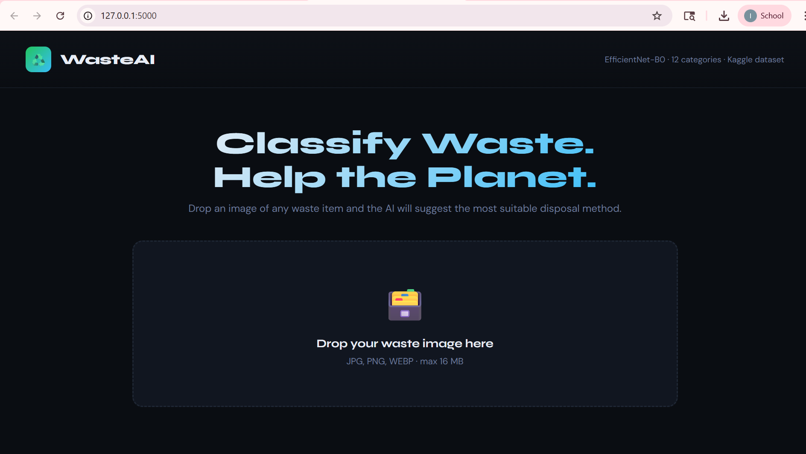
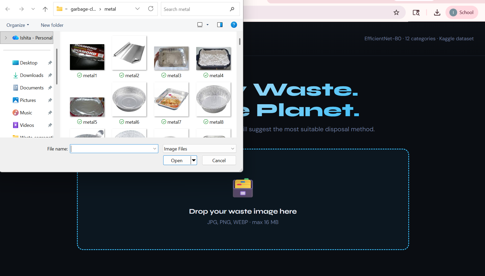
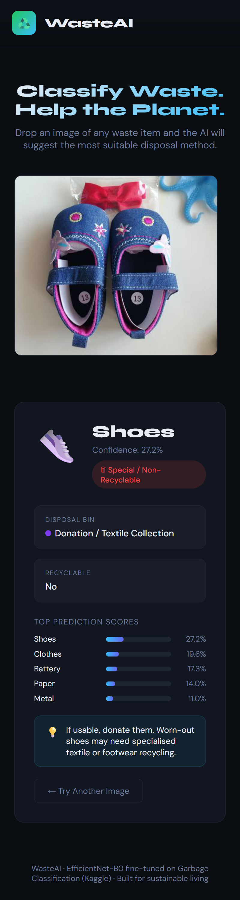
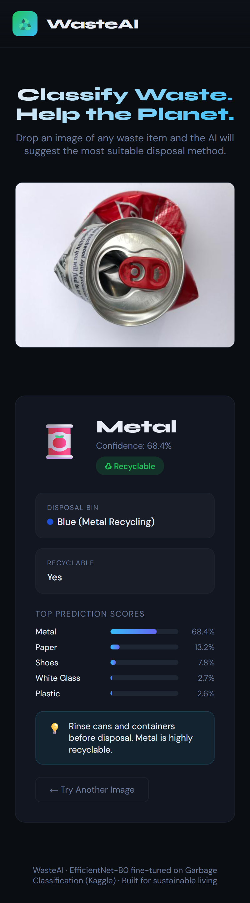

# ♻️ Automatic Waste Segregation

> **AI-powered waste classification using EfficientNet-B0 trained on a 12-class garbage image dataset.**  
> Upload a waste image → get instant category prediction, disposal guidance, recycling status, and confidence scores.


---

## 📋 Table of Contents

- [Overview](#-overview)
- [Features](#-features)
- [Dataset](#-dataset)
- [Classes](#-classes)
- [Model Architecture](#-model-architecture)
- [Project Screenshots](#-project-screenshots)
- [Project Structure](#-project-structure)
- [Quick Start](#-quick-start)
- [Usage](#-usage)
  - [Train](#train-the-model)
  - [Predict CLI](#predict-cli)
  - [Web App](#web-app)
- [Results](#-results)
- [Reproducibility](#-reproducibility)
- [Future Improvements](#-future-improvements)
- [Author](#-author)
- [License](#-license)
- [Acknowledgements](#-acknowledgements)

---

## 🌍 Overview

Proper waste segregation is one of the most important steps toward sustainable waste management, yet many people struggle to identify the correct disposal category for everyday objects.

This project presents an **end-to-end deep learning system** for **automatic waste classification** using computer vision. The model is trained to classify waste images into **12 categories**, and the system is deployed through a **Flask-based web application** that allows users to upload an image and receive:

- the **predicted waste class**
- the **confidence score**
- whether the item is **recyclable**
- the **recommended disposal bin**
- the **top prediction scores** as a bar chart

This project demonstrates the complete AI pipeline — from dataset preparation and model training to web deployment.

---

## ✨ Features

- ✅ 12-class waste classification
- ✅ EfficientNet-B0 deep learning model for image classification
- ✅ Drag & drop image upload web UI
- ✅ Real-time prediction with confidence scores
- ✅ Disposal bin guidance per category
- ✅ Recyclability status for each class
- ✅ Saved trained model for inference
- ✅ CLI prediction tool
- ✅ Unit tests with pytest
- ✅ GitHub Actions CI pipeline

---

## 📦 Dataset

**Source:** [Garbage Classification Dataset — Kaggle (mostafaabla)](https://www.kaggle.com/datasets/mostafaabla/garbage-classification)

The dataset contains real-world photographs of waste items organized into class folders, making it directly compatible with `torchvision.datasets.ImageFolder`.

| Split | Images | Percentage |
|-------|--------|------------|
| Train | 11,637 | 75% |
| Validation | 2,327 | 15% |
| Test | 1,551 | 10% |
| **Total** | **15,515** | **100%** |

---

## 🗂 Classes

The model is trained on the following **12 waste categories**:

| Class | Recyclable | Disposal Bin |
|-------|-----------|--------------|
| Cardboard | ✅ Yes | Blue (Recyclable) |
| Battery | ⚠️ Hazardous | Hazardous Waste Drop-off |
| Biological | ♻️ Compost | Green (Organic) |
| Brown Glass | ✅ Yes | Glass Bank |
| Clothes | ✅ Donate/Recycle | Textile Recycling |
| Green Glass | ✅ Yes | Glass Bank |
| Metal | ✅ Yes | Blue (Recyclable) |
| Paper | ✅ Yes | Blue (Recyclable) |
| Plastic | ✅ Yes | Yellow (Plastic) |
| Shoes | ✅ Donate/Recycle | Textile Recycling |
| Trash | ❌ No | Black (Landfill) |
| White Glass | ✅ Yes | Glass Bank |

---

## 🧠 Model Architecture

The project uses **EfficientNet-B0** as the backbone for waste image classification.

```
Input Image (224 × 224 × 3)
        ↓
Image Preprocessing & Augmentation
        ↓
EfficientNet-B0 Backbone 
        ↓
Global Average Pooling → 1280-d feature vector
        ↓
Dropout (p=0.3)
        ↓
Linear (1280 → 256) + ReLU
        ↓
Dropout (p=0.2)
        ↓
Linear (256 → 12)
        ↓
Softmax → class probabilities
```

### Training Strategy

- **Model**: EfficientNet-B0 with a custom classifier head
- **Optimizer**: AdamW with weight decay = 1e-4
- **Loss**: CrossEntropyLoss with label smoothing (ε = 0.1)
- **Scheduler**: CosineAnnealingLR (T_max = 20)
- **Batch size**: 32
- **Input size**: 224 × 224
- **Epochs**: 20

### Data Augmentation

| Transform | Purpose |
|-----------|---------|
| RandomHorizontalFlip | Orientation invariance |
| RandomRotation(±20°) | Camera tilt robustness |
| RandomResizedCrop | Scale and framing variation |
| ColorJitter | Lighting and colour variation |
| RandomAffine | Translation and scale variation |
| RandomGrayscale(p=0.05) | Reduce over-reliance on colour |

---

## 🖼 Project Screenshots

### 1) WasteAI Homepage
Upload interface with drag-and-drop support.



---

### 2) Image Upload
Users can drag & drop or click to upload any waste image.



---

### 3) Prediction Result
The app shows predicted class, confidence score, recyclability, disposal bin, and top scores.



---

### 4) Another Example Prediction




## 🗂 Project Structure

```
waste-segregation/
│
├── src/
│   ├── train.py              # Training pipeline 
│   ├── predict.py            # CLI inference script
│   └── app.py                # Flask web application
│
├── notebooks/
│   └── 01_eda.ipynb          # Exploratory data analysis
│
├── scripts/
│   └── download_dataset.py   # Kaggle dataset downloader
│
├── tests/
│   └── test_model.py         # Unit tests (pytest)
│
├── docs/                   
│   ├── homepage.png
│   ├── upload.png
│   ├── result1.png
│   └── result2.png
│
├── models/                   # Saved weights & metadata (gitignored)
│   ├── best_model.pth
│   ├── model_meta.json
│   ├── training_history.png
│   └── confusion_matrix.png
│
├── data/                     # Dataset root (gitignored)
│   └── garbage-classification/
│
├── .github/workflows/ci.yml  # GitHub Actions CI
├── Dockerfile
├── requirements.txt
├── .gitignore
└── README.md
```

---

## 🚀 Quick Start

### 1. Clone the repository

```bash
git clone https://github.com/Ishita-1408/Automatic-waste-segregation.git
cd waste-segregation
```

### 2. Create a virtual environment

**Windows:**
```bash
python -m venv .venv
.venv\Scripts\activate
```

**Linux / macOS:**
```bash
python -m venv .venv
source .venv/bin/activate
```

### 3. Install PyTorch

**CPU only (works on any laptop):**
```bash
pip install torch torchvision --index-url https://download.pytorch.org/whl/cpu
```

**GPU (CUDA):**
```bash
pip install torch torchvision
```

### 4. Install remaining dependencies

```bash
pip install -r requirements.txt
```

### 5. Download the dataset

Set up Kaggle credentials first:
1. Go to https://www.kaggle.com/settings → API → Create New Token
2. Place `kaggle.json` at `~/.kaggle/kaggle.json` (Windows: `C:\Users\YourName\.kaggle\`)

Then run:
```bash
python scripts/download_dataset.py
```

Or download manually:
```bash
kaggle datasets download -d mostafaabla/garbage-classification -p data
```

Then extract into `data/garbage-classification/` so each class has its own subfolder.

---

## 🔧 Usage

### Train the model

```bash
python src/train.py --data data/garbage-classification --output models/
```

| Flag | Default | Description |
|------|---------|-------------|
| `--data` | `data/garbage-classification` | Path to dataset root |
| `--output` | `models/` | Where to save weights & plots |

Training saves:
- `models/best_model.pth` — best model weights
- `models/model_meta.json` — class names and config
- `models/training_history.png` — loss & accuracy curves
- `models/confusion_matrix.png` — test set confusion matrix

---

### Predict CLI

**Single image:**
```bash
python src/predict.py --image path/to/your/image.jpg
```

**Example output:**
```
==================================================
Image      : bottle.jpg
Prediction : PLASTIC (94.2%)
Bin        : Yellow (Plastic)
Recyclable : Yes ♻
Tip        : Check the resin code. Codes 1 & 2 are most widely accepted.

Top predictions:
  plastic      ████████████████████  94.2%
  white-glass  ██                     3.1%
  metal                               1.8%
```

**Batch prediction (whole folder):**
```bash
python src/predict.py --dir path/to/images/ --output results.json
```

---

### Web App

```bash
python src/app.py
```

Open your browser and go to: **http://localhost:5000**

Features:
- Drag & drop or click-to-upload
- Instant prediction results
- Top 5 class confidence visualization
- Bin colour indicator
- Recycling tip per category

---
## 📊 Results

The model was trained for **20 epochs** on the 12-class waste classification dataset using **EfficientNet-B0**.

| Metric | Value |
|--------|-------|
| Best Validation Accuracy | **73.10%** |
| Model Backbone | **EfficientNet-B0** |
| Number of Classes | **12** |
| Epochs Trained | **20** |
| Model File Size | **~18 MB** |

Performance may vary slightly across runs due to random initialisation and dataset complexity.

> ⚠️ Real-world images may sometimes produce uncertain predictions due to lighting, background clutter, camera angle, or visual similarity between classes.

## 🔁 Reproducibility

Dataset splitting uses a fixed random seed for consistency:

```python
random_split(..., generator=torch.Generator().manual_seed(42))
```

To reproduce results:
```bash
python src/train.py --data data/garbage-classification --output models/
```

---

## 🧪 Running Tests

```bash
pip install pytest
pytest tests/ -v
```

---
## ⚠️ Limitations

- The model is trained on a fixed dataset and may struggle with highly cluttered or unusual real-world images.
- Some visually similar classes (for example, `paper` vs `cardboard`, or different glass categories) may occasionally be confused.
- The model currently performs **image classification only**, not object detection.
- Disposal guidance may vary across cities and local recycling policies.
---

## 🚧 Future Improvements

- Grad-CAM visualisation to explain predictions
- Confidence thresholding for uncertain predictions
- Mobile app deployment
- Waste detection using object detection (YOLO)
- Larger and more diverse dataset
- ONNX export for faster CPU inference
- Per-municipality bin guidance

---

## 👩‍💻 Author

**Ishita**  
Student Project — Deep Learning, Computer Vision, and Sustainable AI Applications

This project was built as a beginner-friendly end-to-end AI application demonstrating practical machine learning, model deployment, and sustainable technology.

---

## 🙏 Acknowledgements

- **Dataset**: [Garbage Classification — Kaggle (mostafaabla)](https://www.kaggle.com/datasets/mostafaabla/garbage-classification)
- **Model**: [EfficientNet (Tan & Le, 2019)](https://arxiv.org/abs/1905.11946)
- **Framework**: [PyTorch](https://pytorch.org/) & [torchvision](https://pytorch.org/vision/)
- **Web Framework**: [Flask](https://flask.palletsprojects.com/)
